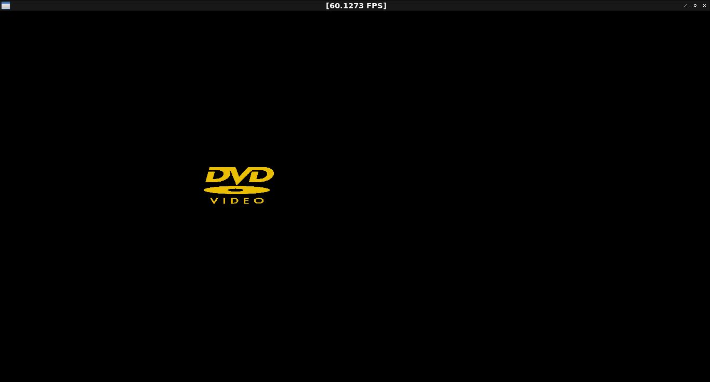

# glfw-test
My GLFW execises

# DVD Animation
My first experiment with OpenGL that replicates the classic DVD Video animation


# Installation
I assume that you are using Ubuntu. First you need to install all of the prerequisites

```./configure```

If this was done successfully then you can compile the project with

```make```